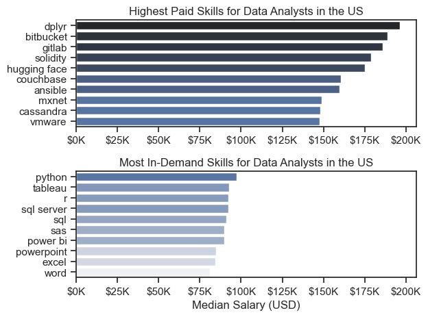

# Overview
Welcome to my analysis of the data job market, focusing on data analyst roles. This project was created out of a desire to navigate and understand the job market more effectively. It delves into the top-paying and in-demand skills to help find optimal job opportunities for data analysts.

The data sourced from Luke Barousse's Python Course which provides a foundation for my analysis, containing detailed information on job titles, salaries, locations, and essential skills. Through a series of Python scripts, I explore key questions such as the most demanded skills, salary trends, and the intersection of demand and salary in data analytics.

# The Questions
### Below are the questions I want to answer in my project:

- What are the skills most in demand for the top 3 most popular data roles?
- How are in-demand skills trending for Data Analysts?
- How well do jobs and skills pay for Data Analysts?
- What are the optimal skills for data analysts to learn? (High Demand AND High Paying)
# Tools I Used
For my deep dive into the data analyst job market, I harnessed the power of several key tools:

- Python: The backbone of my analysis, allowing me to analyze the data and find critical insights.I also used the following Python libraries:
- Pandas Library: This was used to analyze the data.
- Matplotlib Library: I visualized the data.
- Seaborn Library: Helped me create more advanced visuals.
- Jupyter Notebooks: The tool I used to run my Python scripts which let me easily include my notes and analysis.
- Visual Studio Code: My go-to for executing my Python scripts.
- Git & GitHub: Essential for version control and sharing my Python code and analysis, ensuring collaboration and project tracking.
# Data Preparation and Cleanup
#### This section outlines the steps taken to prepare the data for analysis, ensuring accuracy and usability.

# Import & Clean Up Data
I start by importing necessary libraries and loading the dataset, followed by initial data cleaning tasks to ensure data quality.
```python
# Importing Libraries
import ast
import pandas as pd
import seaborn as sns
from datasets import load_dataset
import matplotlib.pyplot as plt  

# Loading Data
dataset = load_dataset('lukebarousse/data_jobs')
df = dataset['train'].to_pandas()

# Data Cleanup
df['job_posted_date'] = pd.to_datetime(df['job_posted_date'])
df['job_skills'] = df['job_skills'].apply(lambda x: ast.literal_eval(x) if pd.notna(x) else x)
```
# Filter US Jobs
To focus my analysis on the U.S. job market, I apply filters to the dataset, narrowing down to roles based in the United States.
```python
df_US = df[df['job_country'] == 'United States']
```

 # The Analysis

 Each Jupyter notebook for this project aimed at investigating specific aspects of the data job market. Here’s how I approached each question:

## 1.What are the most demanded skills for the top 3 most popular data roles?

To find the most demanded skills for the top 3 most popular data roles. I filtered out those positions by which ones were the most popular, and got the top 5 skills for these top 3 roles. This query highlights the most popular job titles and their top skills, showing which skills I should pay attention to depending on the role I'm targeting.

View my notebook with detailed steps here: [2_Skill_Count.ipynb](2_Skills_Count.ipynb)

### Visualize Data

```python
fig, ax = plt.subplots(len(job_titles), 1)

sns.set_theme(style='ticks')

for i, job_title in enumerate(job_titles):
    df_plot = df_skills_perc[df_skills_perc['job_title_short'] == job_title].head(5)
    sns.barplot(data=df_plot, x='skill_percent', y='job_skills', ax=ax[i], hue='skill_count', palette='dark:b_r')
    ax[i].set_title(job_title)
    ax[i].set_ylabel('')
    ax[i].set_xlabel('')
    ax[i].get_legend().remove()
    ax[i].set_xlim(0, 78)

    for n, v in enumerate(df_plot['skill_percent']):
        ax[i].text(v + 1, n, f'{v:.0f}%', va='center')
    if i != len(job_titles) -1:
        ax[i].set_xticks([])

fig.suptitle('Likelihood of Skills Requested In US Job Postings', fontsize=15)
fig.tight_layout(h_pad=0.5) # fix the overlap
plt.show()
```

### Results


### Insights

- SQL is a dominant skill across all three roles, topping the bars for Data Analyst at 51% and Data Engineers at 68%.

- Python follows a close second to SQL in the requested skills, topping Data Scientists with a 72% and comming second for Data Engineers with a 65%.

- Data Analysts and Scientists
require more general data management and analysis tools when compared to Data Engineers who require more technical skills such as Azure and Spark.

## 2. How are In-Demand skills trending for Data Analysts?

### Visualize Data 

```python
df_plot = df_DA_US_Percent.iloc[:, :5]

sns.lineplot(data=df_plot, dashes=False, palette='tab10')
sns.set_theme(style='ticks')
sns.despine()

plt.title('Trending Top Skills For Data Analysts In The US')
plt.ylabel('Likelihood In Job Posting')
plt.xlabel('2023')
plt.legend().remove()
from matplotlib.ticker import PercentFormatter
ax=plt.gca()
ax.yaxis.set_major_formatter(PercentFormatter(decimals=0))

for i in range(5):
    plt.text(11.2, df_plot.iloc[-1, i], df_plot.columns[i])
```

### Results

*Bar Graph visualizing the trending top skills for data analysts in the US in 2023.*

### Insights:

- SQL remains the number 1 listed 'required' skill throughout the year with a slight drop towards the later part of the year. However it remains far above the other listed skills.
- Excel remains stable throughout the first half of the year,showing a large drop around September then slowly appearing in more job postings towards the end of the year.
- All job skills seem to be stable during the first quarter of the year before taking a drop between June and October, and finally gaining new traction towards the later end of the year.

### 3. How well do jobs and skills pay for Data Analysts?

### Salary Analysis

### Visualize Data

```python
sns.boxplot(data=df_US_top6, x='salary_year_avg', y='job_title_short', order=job_order)
sns.set_theme(style='ticks')

plt.title('Salary Distributions in the US')
plt.xlabel('Yealy Salary(USD)')
plt.ylabel('')
plt.xlim(0, 600000)
ticks_x = plt.FuncFormatter(lambda y, pos: f'${int(y/1000)}K')
plt.gca().xaxis.set_major_formatter(ticks_x)
plt.show()
```

### Results 

*Box plot visualizing the salary distributions for the top 6 data job titles.*

### Insights
- Senior Roles are shown to have a wider range in yearly salary, starting from the median of it's original role and earning up to $100,000 more on average.

- Data analyst roles earn lowest among the group, despite the lack of experience, Data Engineers and Data Scientists earn more than even the Senior Data Analyst roles by a descent margin.

- Both Data Scientists and Senior Data Scientists have
larger outliers than their counterpart roles, with some earning up to $580,000 yearly. When compared to the highest paid Senior Data Engineer only earning $380,000 yearly the difference is apparent.

### 4. How well do jobs and skills pay for Data

### Highest Paid & Most Demanded Skills For Data Analyst

### Visualize Data

```python
fig, ax = plt.subplots(2, 1)  

# Top 10 Highest Paid Skills for Data Analysts
sns.barplot(data=df_DA_top_pay, x='median', y=df_DA_top_pay.index, hue='median', ax=ax[0], palette='dark:b_r')
ax[0].legend().remove()
# original code:
# df_DA_top_pay[::-1].plot(kind='barh', y='median', ax=ax[0], legend=False) 
ax[0].set_title('Highest Paid Skills for Data Analysts in the US')
ax[0].set_ylabel('')
ax[0].set_xlabel('')
ax[0].xaxis.set_major_formatter(plt.FuncFormatter(lambda x, _: f'${int(x/1000)}K'))


# Top 10 Most In-Demand Skills for Data Analysts')
sns.barplot(data=df_DA_skills, x='median', y=df_DA_skills.index, hue='median', ax=ax[1], palette='light:b')
ax[1].legend().remove()
# original code:
# df_DA_skills[::-1].plot(kind='barh', y='median', ax=ax[1], legend=False)
ax[1].set_title('Most In-Demand Skills for Data Analysts in the US')
ax[1].set_ylabel('')
ax[1].set_xlabel('Median Salary (USD)')
ax[1].set_xlim(ax[0].get_xlim())  # Set the same x-axis limits as the first plot
ax[1].xaxis.set_major_formatter(plt.FuncFormatter(lambda x, _: f'${int(x/1000)}K'))

sns.set_theme(style='ticks')
plt.tight_layout()
plt.show()
```

### Results

*Two separate bar graphs visualizing the highest paid skills and most in-demand skills for data analysts in the US.*

### Insights

- There is a clear difference between the in-deman skills and the highest paying skills. Showing technical skills to be highest paying such as dplyr and gitlab. While foundational skills are more in demand such as python and sql.

- The distinct difference between the two graphs show that in order to succeed as a Data Analysts you should learn a variety of fundamental skills to get started, then build up your technical skills as you seek greater compensation.

- In-Demand skills are centered around large programs or languages, while highest paying skills tend to be extensions of these larger languages which help analysts with organizing, visualizing or data management.

### 5. What is the most optimal skill to learn for Data Analysts?

### Visualize Data
```python
sns.scatterplot(
    data=df_DA_skills_tech_high_demand,
    x='skill_percent',
    y='median_salary',
    hue='technology'
)

sns.despine()
sns.set_theme(style='ticks')

# Prepare texts for adjustText
texts = []
for i, txt in enumerate(df_DA_skills_high_demand.index):
    texts.append(plt.text(df_DA_skills_high_demand['skill_percent'].iloc[i], df_DA_skills_high_demand['median_salary'].iloc[i], txt))

# Adjust text to avoid overlap
adjust_text(texts, arrowprops=dict(arrowstyle='->', color='gray'))

# Set axis labels, title, and legend
plt.xlabel('Percent of Data Analyst Jobs')
plt.ylabel('Median Yearly Salary')
plt.title('Most Optimal Skills for Data Analysts in the US')
plt.legend(title='Technology')

from matplotlib.ticker import PercentFormatter
ax = plt.gca()
ax.yaxis.set_major_formatter(plt.FuncFormatter(lambda y, pos: f'${int(y/1000)}K'))
ax.xaxis.set_major_formatter(PercentFormatter(decimals=0))

# Adjust layout and display plot 
plt.tight_layout()
plt.show()
```

### Results

*A scatter plot visualizing the most optimal skills (high paying & high demand) for data analysts in the US.*

### Insights
- The scatterplot shows that programming skills (in blue) such as python and sql are the most optimal skills for Data Analysts. They seem to be the highest paying while also showing up on a large percent of Data Analysts roles. As all of the skills lay above the $90k range and span throughout most of the analyst jobs range, some reaching up to 58%.

- Both Databases (in green) and Clouds (in red) show high potential in salary, however they lack in Data Analyst jobs
which shows they might not be as optimal to learn as a Data Analyst when compared to other skills & tools.

-  Analyst tools (in orange) are the most diverce in the scatterplot, showing some skills as very optimal due to the high salary and large percent of jobs, while others show among the lowest salary and little showings in Data Analyst jobs. It's also good to keep in mind that the popular analyst tools seem to be most optimal for Data Analysts such as tableau and power bi.

# What I Learned
Throughout this project, I deepened my understanding of the data analyst job market and enhanced my technical skills in Python, especially in data manipulation and visualization. Here are a few specific things I learned:

- Advanced Python Usage: Utilizing libraries such as Pandas for data manipulation, Seaborn and Matplotlib for data visualization, and other libraries helped me perform complex data analysis tasks more efficiently.
- Data Cleaning Importance: I learned that thorough data cleaning and preparation are crucial before any analysis can be conducted, ensuring the accuracy of insights derived from the data.
- Strategic Skill Analysis: The project emphasized the importance of aligning one's skills with market demand.Understanding the relationship between skill demand, salary, and job availability allows for more strategic career planning in the tech industry.
# Insights
This project provided several general insights into the data job market for analysts:

+ Skill Demand and Salary Correlation: There is a clear correlation between the demand for specific skills and the salaries these skills command. Advanced and specialized skills like Python and Oracle often lead to higher salaries.
+ Market Trends: There are changing trends in skill demand, highlighting the dynamic nature of the data job market. Keeping up with these trends is essential for career growth in data analytics.
+ Economic Value of Skills: Understanding which skills are both in-demand and well-compensated can guide data analysts in prioritizing learning to maximize their economic returns.

# Challenges I Faced
This project was not without its challenges, but it provided good learning opportunities:

Data Inconsistencies: Handling missing or inconsistent data entries requires careful consideration and thorough data-cleaning techniques to ensure the integrity of the analysis.

Complex Data Visualization: Designing effective visual representations of complex datasets was challenging but critical for conveying insights clearly and compellingly.

Balancing Breadth and Depth: Deciding how deeply to dive into each analysis while maintaining a broad overview of the data landscape required constant balancing to ensure comprehensive coverage without getting lost in details.

# Conclusion
This exploration into the data analyst job market has been incredibly informative, highlighting the critical skills and trends that shape this evolving field. The insights I got enhance my understanding and provide actionable guidance for anyone looking to advance their career in data analytics. As the market continues to change, ongoing analysis will be essential to stay ahead in data analytics. This project is a good foundation for future explorations and underscores the importance of continuous learning and adaptation in the data field.